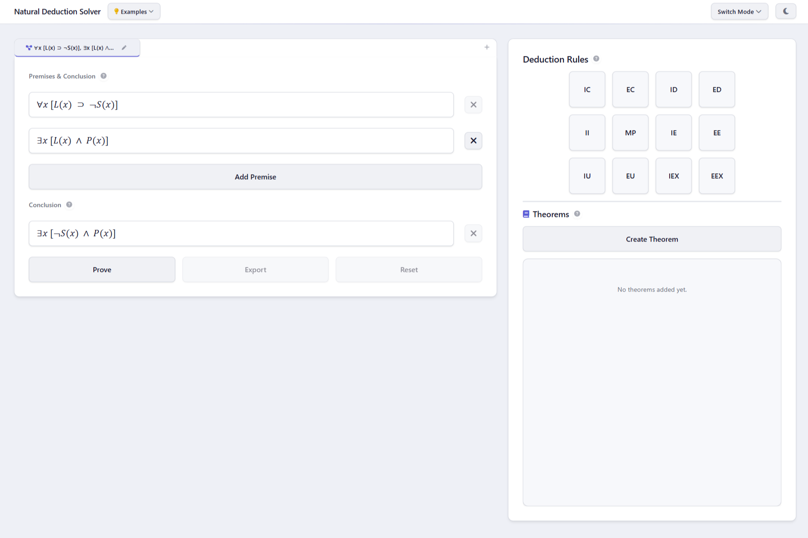
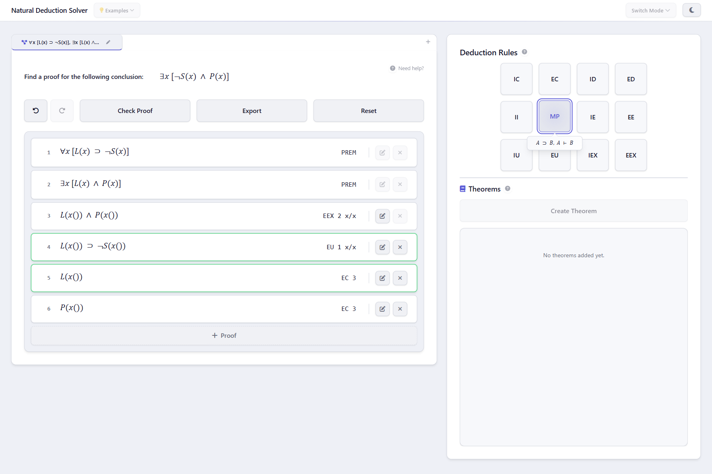
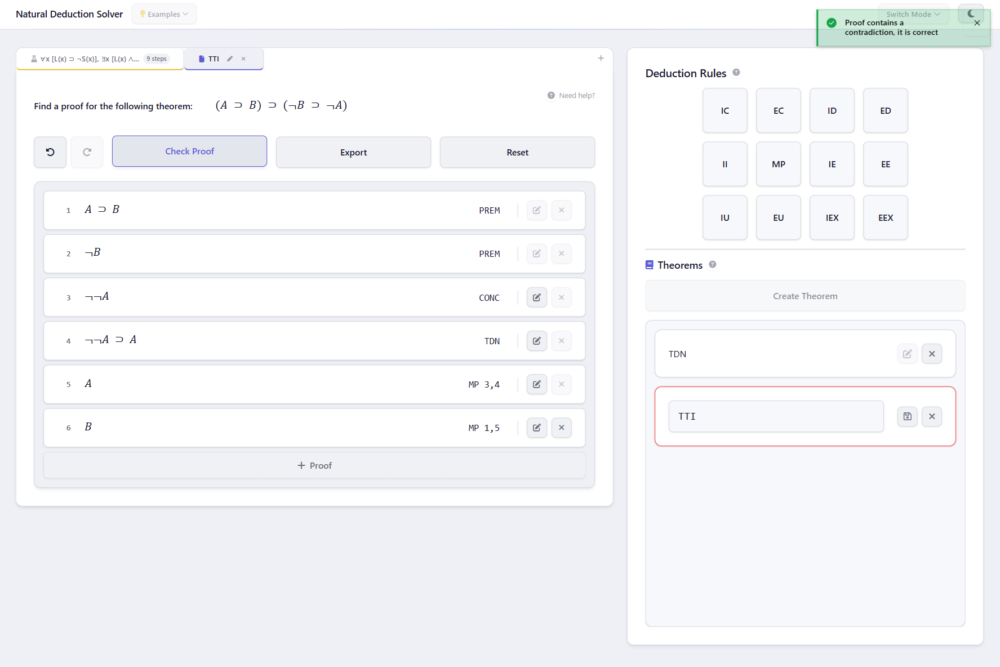
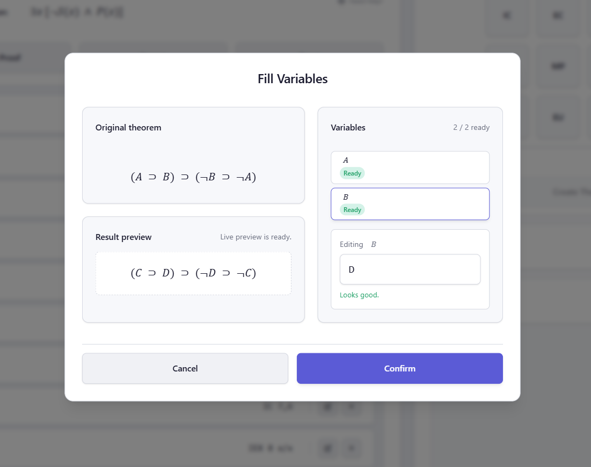
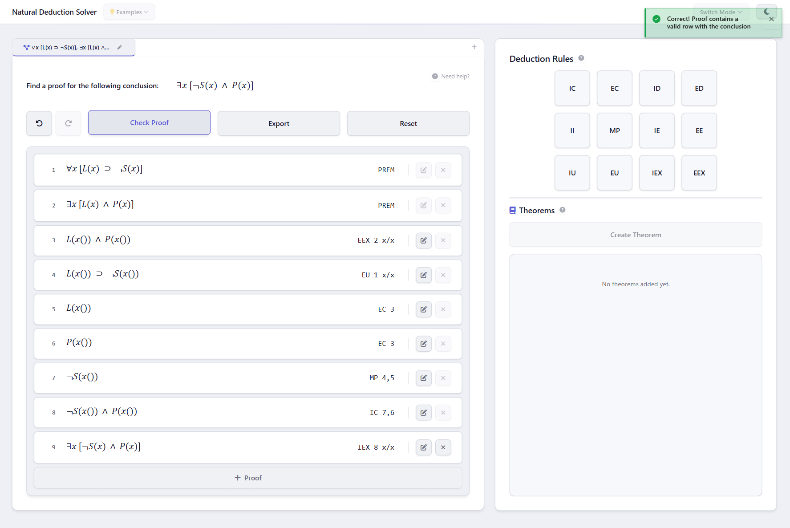
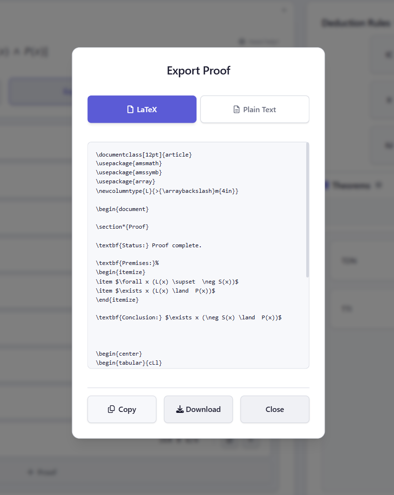

<a id="top"></a>

# Natural Deduction Solver

[](https://github.com/fjenda/natural-deduction-solver/actions/workflows/static.yml)
[](https://github.com/fjenda/natural-deduction-solver/releases)
[](https://github.com/fjenda/natural-deduction-solver/blob/main/LICENSE)
[](https://github.com/fjenda/natural-deduction-solver/issues)
[](https://github.com/fjenda/natural-deduction-solver/commits/main)

> **An interactive, browser-based tool for learning and constructing natural deduction proofs in propositional and predicate logic.**

---

<a id="demo"></a>

## 🖥️ Demo / Preview

<p align="center">
  
</p>
<p align="center"><em>The main workspace — enter premises, a conclusion, and build your proof step by step.</em></p>

🔗 **Live Demo:** [https://fjenda.github.io/natural-deduction-solver/](https://fjenda.github.io/natural-deduction-solver/)

---

<a id="table-of-contents"></a>

## 📑 Table of Contents

- [Demo / Preview](#demo)
- [Features](#features)
- [Tech Stack](#tech-stack)
- [Getting Started](#getting-started)
    - [Prerequisites](#prerequisites)
    - [Installation](#installation)
    - [Running Locally](#running-locally)
- [Usage](#usage)
    - [Entering Premises & Conclusion](#entering-premises)
    - [Applying Deduction Rules](#applying-rules)
    - [Creating & Using Theorems](#creating-theorems)
    - [Checking & Exporting Proofs](#checking-proofs)
- [Project Structure](#project-structure)
- [Testing](#testing)
- [Deployment](#deployment)
- [Contributing](#contributing)
- [Roadmap](#roadmap)
- [License](#license)
- [Acknowledgements](#acknowledgements)

---

<a id="features"></a>

## ✨ Features

- 🧮 **Propositional & Predicate Logic** — Supports both propositional logic (∧, ∨, ⊃, ≡, ¬) and first-order predicate logic (∀, ∃) with seamless mode switching.
- 📐 **Interactive Proof Construction** — Build proofs step-by-step by applying deduction rules to selected rows in a structured proof table.
- ✅ **Real-Time Proof Verification** — Powered by SWI-Prolog compiled to WebAssembly, every rule application is verified for correctness in the browser.
- 📝 **Custom Theorem System** — Define, save, and reuse your own theorems as derived rules to accelerate complex proofs.
- 🔀 **Multi-Workspace Tabs** — Work on multiple proofs simultaneously with tabbed workspaces and editable tab names.
- 💡 **Built-In Starter Examples** — Choose from pre-configured examples (Modus Ponens, Modus Tollens, Hypothetical Syllogism, and more) to get started instantly.
- 📤 **Proof Export** — Export completed proofs as formatted LaTeX for inclusion in academic papers and assignments.
- 🌗 **Dark / Light Theme** — Toggle between themes with a single click for comfortable viewing in any environment.

---

<a id="tech-stack"></a>

## 🛠️ Tech Stack

| Category | Technology | Purpose |
|---|---|---|
| **Framework** | [Svelte 5](https://svelte.dev/) | Reactive UI components with fine-grained reactivity |
| **Language** | [TypeScript](https://www.typescriptlang.org/) | Type-safe application logic |
| **Build Tool** | [Vite](https://vitejs.dev/) | Fast dev server and optimized production builds |
| **Logic Engine** | [SWI-Prolog (WASM)](https://www.swi-prolog.org/packs/list?p=swipl-wasm) | In-browser proof verification and rule validation |
| **Styling** | [SASS/SCSS](https://sass-lang.com/) | Structured, maintainable stylesheets |
| **Testing** | [Vitest](https://vitest.dev/) | Unit and integration testing |
| **Linting** | [ESLint](https://eslint.org/) + [Prettier](https://prettier.io/) | Code quality and consistent formatting |
| **Rendering** | [MathML](https://www.w3.org/Math/) | Beautiful mathematical formula rendering |
| **Deployment** | [GitHub Pages](https://pages.github.com/) | Automated static site hosting |

---

<a id="getting-started"></a>

## 🚀 Getting Started

<a id="prerequisites"></a>

### Prerequisites

Ensure you have the following installed on your system:

| Requirement | Minimum Version | Check Command |
|---|---|---|
| [Node.js](https://nodejs.org/) | `>= 18.0.0` | `node --version` |
| [npm](https://www.npmjs.com/) | `>= 9.0.0` | `npm --version` |
| [Git](https://git-scm.com/) | `>= 2.30.0` | `git --version` |

<a id="installation"></a>

### Installation

1. **Clone the repository**

```bash
git clone https://github.com/fjenda/natural-deduction-solver.git
cd natural-deduction-solver
```

2. **Install dependencies**

```bash
npm install
```

<a id="running-locally"></a>

### Running Locally

Start the development server with hot-reload:

```bash
npm run dev
```

The application will be available at `http://localhost:5173/natural-deduction-solver/`.

<details>
<summary>📦 Building for Production</summary>

To create an optimized production build:

```bash
npm run build
```

To preview the production build locally:

```bash
npm run preview
```

The built files will be output to the `dist/` directory.

</details>

---

<a id="usage"></a>

## 📖 Usage

<a id="entering-premises"></a>

### Entering Premises & Conclusion

Define your proof by entering logical formulas in the **Premises & Conclusion** panel. Use the on-screen operator keyboard or type formulas directly using the supported syntax.

<p align="center">
  
</p>
<p align="center"><em>Enter premises using logical operators (∧, ∨, ⊃, ≡, ¬, ∀, ∃) and click "Prove" to begin.</em></p>

**Supported Operators:**

| Symbol | Name | Propositional | Predicate |
|---|---|---|---|
| `∧` | Conjunction (AND) | ✅ | ✅ |
| `∨` | Disjunction (OR) | ✅ | ✅ |
| `⊃` | Implication | ✅ | ✅ |
| `≡` | Equivalence | ✅ | ✅ |
| `¬` | Negation (NOT) | ✅ | ✅ |
| `∀` | Universal Quantifier | ❌ | ✅ |
| `∃` | Existential Quantifier | ❌ | ✅ |

> **Tip:** Use the **"Switch Mode"** dropdown in the top-right corner to toggle between propositional and predicate logic.

<a id="applying-rules"></a>

### Applying Deduction Rules

Once in proof mode, apply rules from the **Deduction Rules** grid on the right-hand sidebar. Select one or more rows in the proof table, then click a rule button to apply it.

<p align="center">
  
</p>
<p align="center"><em>Select rows and apply rules — the system verifies correctness automatically.</em></p>

**Available Deduction Rules:**

| Abbreviation | Rule Name | Schema |
|---|---|---|
| **IC** | Introduction of Conjunction | A, B ⊢ A ∧ B |
| **EC** | Elimination of Conjunction | A ∧ B ⊢ A / A ∧ B ⊢ B |
| **ID** | Introduction of Disjunction | A ⊢ A ∨ B |
| **ED** | Elimination of Disjunction | A ∨ B, ¬A ⊢ B |
| **II** | Introduction of Implication | B ⊢ A ⊃ B |
| **MP** | Modus Ponens | A ⊃ B, A ⊢ B |
| **IE** | Introduction of Equivalence | A ⊃ B, B ⊃ A ⊢ A ≡ B |
| **EE** | Elimination of Equivalence | A ≡ B ⊢ A ⊃ B / A ≡ B ⊢ B ⊃ A |
| **IU** | Introduction of ∀ | A(x) ⊢ ∀xA(x) |
| **EU** | Elimination of ∀ | ∀xA(x) ⊢ A(x/t) |
| **IEX** | Introduction of ∃ | A(x/t) ⊢ ∃xA(x) |
| **EEX** | Elimination of ∃ | ∃xA(x) ⊢ A(x/c) |

<a id="creating-theorems"></a>

### Creating & Using Theorems

Create reusable theorems to streamline your proofs. Any proven result can be saved as a theorem and applied as a single-step rule in future proofs.

<p align="center">
  
</p>
<p align="center"><em>Define custom theorems with premises and a conclusion.</em></p>

<p align="center">
  
</p>
<p align="center"><em>Apply a saved theorem as a derived rule during proof construction.</em></p>

<a id="checking-proofs"></a>

### Checking & Exporting Proofs

The solver provides real-time feedback on proof validity. When your proof is complete and correct, you can export it.

<p align="center">
  
</p>
<p align="center"><em>A completed proof with all rules verified.</em></p>

<p align="center">
  
</p>
<p align="center"><em>Export your proof as formatted LaTeX.</em></p>

---

<a id="project-structure"></a>

## 📁 Project Structure

```
natural-deduction-solver/
├── .github/
│   └── workflows/
│       └── static.yml              # GitHub Actions — build & deploy to GitHub Pages
├── src/
│   ├── main.ts                     # Application entry point
│   ├── App.svelte                  # Root Svelte component
│   ├── app.css                     # Global styles
│   ├── lib/
│   │   ├── components/             # Reusable UI components
│   │   │   ├── Navbar.svelte       #   Navigation bar with examples & theme toggle
│   │   │   ├── OperatorKeyboard.svelte  #   On-screen logical operator input
│   │   │   ├── WorkspaceTabs.svelte     #   Multi-proof tabbed workspace
│   │   │   ├── ThemeToggle.svelte  #   Dark / light mode switch
│   │   │   └── ...                 #   Buttons, dropdowns, tooltips, hints
│   │   ├── context/                # App-level Svelte context & persistence
│   │   ├── layouts/                # Layout wrappers
│   │   ├── modals/                 # Modal dialogs
│   │   │   ├── ExportProofModal.svelte          #   LaTeX export dialog
│   │   │   ├── FillVariablesModal.svelte        #   Variable substitution UI
│   │   │   ├── SelectProofTypeModal.svelte      #   Direct / indirect proof choice
│   │   │   └── ...
│   │   ├── rules/                  # Deduction rule definitions & UI
│   │   │   ├── DeductionRule.ts    #   NDRule enum & DeductionRule class
│   │   │   ├── Theorem.ts          #   Custom theorem model
│   │   │   └── TheoremRegistry.ts  #   Theorem management & storage
│   │   ├── solver/                 # Core proof-solving engine
│   │   │   ├── Solution.ts         #   Proof state model (premises, conclusion, rows)
│   │   │   ├── FormulaComparer.ts  #   Structural formula comparison
│   │   │   ├── actions/            #   Proof manipulation actions
│   │   │   ├── components/         #   Proof table & premise input UI
│   │   │   ├── containers/         #   High-level solver layout containers
│   │   │   ├── parsers/            #   Pratt parser, formula parser, MathML renderer
│   │   │   ├── services/           #   Proof orchestration service
│   │   │   └── utils/              #   Solver helper utilities
│   │   ├── syntax-checker/         # Formula syntax analysis
│   │   │   ├── PrattParser.ts      #   Operator-precedence parser
│   │   │   ├── Node.ts             #   AST node types
│   │   │   ├── Operator.ts         #   Logical operator definitions
│   │   │   └── TokenStream.ts      #   Lexer / token stream
│   │   └── utils/                  # Shared utilities
│   │       ├── starterExamples.ts  #   Pre-built example proofs
│   │       ├── keyboardShortcuts.ts #  Global keyboard shortcut bindings
│   │       └── loadDefaultValues.ts #  Initial state hydration
│   ├── prolog/                     # SWI-Prolog integration
│   │   ├── PrologController.ts     #   Singleton Prolog WASM controller
│   │   ├── PrologQueryWrapper.ts   #   Type-safe query interface
│   │   ├── pl/                     #   Prolog source programs
│   │   │   ├── ruleset.pl          #     Natural deduction rule definitions
│   │   │   ├── proof_table.pl      #     Proof table management predicates
│   │   │   ├── args_table.pl       #     Argument table operations
│   │   │   ├── substitute.pl       #     Variable substitution logic
│   │   │   ├── free_vars.pl        #     Free variable analysis
│   │   │   └── theorem_table.pl    #     Theorem storage predicates
│   │   └── queries/                #   Pre-built Prolog query templates
│   ├── stores/                     # Svelte reactive stores
│   │   ├── workspaceStore.ts       #   Multi-workspace state management
│   │   ├── historyStore.ts         #   Undo / redo history
│   │   ├── theoremsStore.ts        #   Custom theorem registry state
│   │   ├── solverStore.ts          #   Solver configuration (logic mode, etc.)
│   │   └── stateStore.ts           #   Global UI state
│   └── types/                      # TypeScript type definitions
│       ├── TableRow.ts             #   Proof table row type
│       ├── TreeRuleType.ts         #   Rule application tree node
│       ├── TheoremData.ts          #   Theorem serialization type
│       └── ...
├── tests/                          # Test suites
│   ├── prolog/queries/             #   Prolog query integration tests
│   └── stores/                     #   Svelte store unit tests
├── index.html                      # Application HTML shell
├── vite.config.ts                  # Vite configuration
├── svelte.config.js                # Svelte compiler options
├── tsconfig.json                   # TypeScript configuration
├── eslint.config.js                # ESLint rules
├── .prettierrc                     # Prettier formatting rules
└── package.json                    # Dependencies & scripts
```

---

<a id="testing"></a>

## 🧪 Testing

The project uses [Vitest](https://vitest.dev/) for unit and integration testing.

**Run all tests:**

```bash
npm run test
```

**Run tests with coverage report:**

```bash
npm run coverage
```

Coverage reports are generated in the `coverage/` directory using the V8 coverage provider.

**Run type checking:**

```bash
npm run check
```

**Run linting:**

```bash
npm run lint
```

**Auto-format code:**

```bash
npm run format
```

---

<a id="deployment"></a>

## 🌐 Deployment

The application is automatically deployed to **GitHub Pages** on every push to `main` via [GitHub Actions](https://github.com/fjenda/natural-deduction-solver/actions).

### Automated Deployment (CI/CD)

The workflow (`.github/workflows/static.yml`) performs the following steps:

1. Checks out the repository
2. Sets up Node.js 18
3. Installs dependencies with `npm ci`
4. Builds the production bundle with `npm run build`
5. Deploys the `dist/` folder to the `gh-pages` branch

> The live site is published at: [https://fjenda.github.io/natural-deduction-solver/](https://fjenda.github.io/natural-deduction-solver/)

### Manual Deployment

To deploy manually to any static hosting provider:

```bash
# 1. Build the production bundle
npm run build

# 2. Deploy the dist/ folder to your hosting provider
#    Example with gh-pages:
npx gh-pages -d dist
```

<details>
<summary>⚙️ Custom Base Path</summary>

The application is configured with a base path of `/natural-deduction-solver/` in `vite.config.ts`. If you deploy to a different path, update the `base` option:

```typescript
// vite.config.ts
export default defineConfig({
  base: '/your-custom-path/',
  // ...
});
```

</details>

---

<a id="contributing"></a>

## 🤝 Contributing

Contributions are welcome! Here's how you can help:

### Fork & PR Workflow

1. **Fork** the repository
2. **Create** a feature branch:
   ```bash
   git checkout -b feature/your-feature-name
   ```
3. **Make** your changes and ensure all checks pass:
   ```bash
   npm run lint
   npm run check
   npm run test
   ```
4. **Commit** using [Conventional Commits](https://www.conventionalcommits.org/):
   ```bash
   git commit -m "feat: add support for double negation elimination"
   ```
5. **Push** and open a Pull Request:
   ```bash
   git push origin feature/your-feature-name
   ```

### Code Style

- **Formatting** is enforced by [Prettier](https://prettier.io/) — run `npm run format` before committing.
- **Linting** via [ESLint](https://eslint.org/) with Svelte and TypeScript plugins.
- **Type safety** is verified with `svelte-check` and `tsc`.

### Commit Convention

| Prefix | Purpose |
|---|---|
| `feat:` | New feature |
| `fix:` | Bug fix |
| `docs:` | Documentation changes |
| `style:` | Code formatting (no logic changes) |
| `refactor:` | Code restructuring |
| `test:` | Adding or updating tests |
| `chore:` | Build tools, dependencies, etc. |

---

<a id="roadmap"></a>

## 🗺️ Roadmap

- [x] Propositional logic proof construction
- [x] Predicate logic with quantifier rules
- [x] Custom theorem creation and reuse
- [x] Proof export to LaTeX
- [ ] Automatic proof solver / hint system
- [ ] Proof persistence via URL sharing
- [ ] Step-by-step guided tutorial mode
- [ ] Additional export formats (PDF, PNG)
- [ ] Localization / i18n support

---

<a id="license"></a>

## 📄 License

This project is licensed under the terms specified in the [LICENSE](./LICENSE) file.

[](https://github.com/fjenda/natural-deduction-solver/blob/main/LICENSE)

---

<a id="acknowledgements"></a>

## 🙏 Acknowledgements

- **[Svelte](https://svelte.dev/)** — The reactive UI framework powering the frontend.
- **[SWI-Prolog](https://www.swi-prolog.org/)** & **[swipl-wasm](https://github.com/nicknameisnotavailable/swipl-wasm)** — Prolog engine compiled to WebAssembly for in-browser logic verification.
- **[Vite](https://vitejs.dev/)** — Lightning-fast build tooling.
- **[Vitest](https://vitest.dev/)** — Modern testing framework.
- **[Font Awesome](https://fontawesome.com/)** — Icon library used throughout the interface.
- **[svelte-modals](https://github.com/mattjennings/svelte-modals)** — Modal dialog management for Svelte.
- **[svelte-toasts](https://github.com/nicolo-ribaudo/svelte-toasts)** — Toast notification system.

---

<p align="center">
  Made with ❤️ for logic enthusiasts and students of formal reasoning.
  <br />
  <a href="#top">⬆ Back to top</a>
</p>